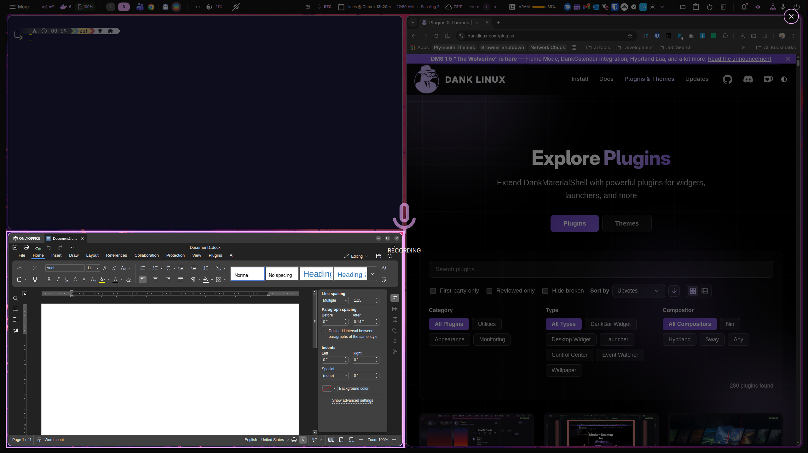
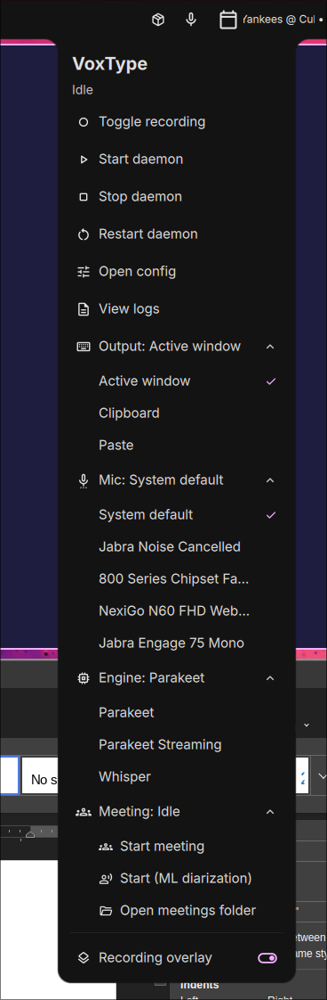

# VoxType Recording Overlay + Control Widget (DankMaterialShell plugin)

A native [DankMaterialShell](https://github.com/AvengeMedia/DankMaterialShell)
(DMS / Quickshell) plugin for [VoxType](https://github.com/peteonrails/voxtype),
in two halves you can use together or independently:

- **A recording overlay** — while VoxType is dictating it dims every monitor,
  cuts a clear hole around the window you were focused on (so you can see where
  your dictated text will land), draws a themed highlight border, and shows a
  pulsing mic. An optional **✕ button** (one per monitor) cancels by mouse.
- **A bar/tray control widget** — a status pill + popout in your DMS bar that
  **replaces the external SNI tray app**: start/stop/restart the VoxType daemon,
  switch output mode, pick your microphone, switch engine, and run meetings —
  all without leaving the bar.

Both are **state-reactive** — the plugin watches VoxType's state file and reacts
instantly. Nothing to wire together: start recording and the overlay appears and
the pill lights up; stop and they clear.

## Screenshots

**Recording overlay** — dim + active-window cutout + pulsing mic while dictating:



**Control popout** — daemon control, output / microphone / engine pickers, and
meeting controls, all from the bar:




## Features

- **Full-screen dim + active-window cutout** so you can see where dictated text
  lands (cutout needs Hyprland; dims everywhere else).
- **Pulsing mic** indicator with a themeable highlight border and optional label.
- **Bar pill** that reflects VoxType state live: idle / recording / transcribing
  / meeting / daemon-stopped, with a pulse while active.
- **One-click quick capture** — left-click the pill to record to the clipboard
  (or auto-paste) with a minimal mic-only overlay.
- **Daemon control** — start / stop / restart `voxtype.service`, open config,
  view logs.
- **Output-mode switch** — Active window (type) / Clipboard / Paste.
- **Microphone picker** — choose the input device by its friendly name.
- **Engine switcher** — swap engines via your own `use-*.sh` presets.
- **Meeting controls** — start / pause / resume / stop, ML diarization, open the
  meetings folder; the pill shows meeting state.
- **Config-safe** — settings changes edit `config.toml` through a section-aware
  TOML editor (never a blind append), or use VoxType's CLI directly.

> ## ⚠️ Compatibility — read first
>
> - **DankMaterialShell ≥ 1.5.0** — declared via `requires_dms` in `plugin.json`
>   (the bar-widget + control-center capabilities need 1.5.0). Built and tested
>   on DMS `v1.5.0-134-g069df80b`. It's a `composite` plugin (daemon + widget)
>   using DMS's standard plugin API.
> - **Compositor** — the widget and the full-screen dim work on **any** wlroots
>   compositor. Only the **active-window cutout** is Hyprland-specific (it shells
>   out to `hyprctl`); without Hyprland the overlay still dims + shows the mic,
>   just without the cutout. Hyprland's config can be classic `.conf` **or** the
>   newer `.lua` — the plugin never reads it, only the `hyprctl` CLI.

## Requirements

- **DankMaterialShell** (Quickshell) ≥ 1.5.0 — see Compatibility above.
- **VoxType**, installed and running (the `voxtype` daemon on your `PATH`).
- Optional, for individual features (all degrade gracefully if absent):
  - **Hyprland** — the active-window cutout only;
  - a **`voxtype.service`** systemd *user* unit — daemon start/stop/restart
    (VoxType's standard install provides this);
  - **`pactl`** (PipeWire or PulseAudio) — the microphone picker;
  - **`xdg-open`** — "Open config" / "View logs" / "Open meetings folder";
  - `~/.config/voxtype/use-*.sh` preset scripts — the engine switcher.

## Install

```bash
git clone https://github.com/rdannenbring/voxtype-dms-overlay ~/Development/voxtype-dms-overlay
ln -sfn ~/Development/voxtype-dms-overlay ~/.config/DankMaterialShell/plugins/voxtypeOverlay
```

Then enable it in **DMS Settings → Plugins → VoxType Recording Overlay**, and add
the pill to your bar in **Settings → Dank Bar** (look for *VoxType*).

> Editing the plugin later? Edits to existing QML files hot-reload via the **↻
> refresh icon** in Settings → Plugins, or `dms ipc call plugins reload
> voxtypeOverlay`. **Adding a brand-new component file** (or changing the plugin
> `type`) needs a full **`dms restart`** — the QML engine only re-scans the
> plugin directory on a full restart.

## Using it

### Trigger recording

Any way of starting VoxType works — the plugin just reacts:

- **VoxType's built-in hotkey** (`[hotkey]` in `~/.config/voxtype/config.toml`),
- **A compositor keybind** bound to `voxtype record toggle` (recommended on
  Hyprland/Sway):
  ```
  bind = , code:191, exec, voxtype record toggle
  ```
  (Hyprland's newer `.lua` config works too. If you use a compositor bind,
  disable the built-in one: `[hotkey] enabled = false`.)
- **The bar pill** — left-click (see *Quick capture* below).

Recording started by hotkey/keybind gets the **full overlay** (dim + cutout) and
uses your configured output mode.

### The bar pill

The pill's icon reflects VoxType's state and pulses while active:

| State | Icon |
|---|---|
| Idle | `mic` |
| Recording | `mic` (pulsing) |
| Transcribing | `graphic_eq` |
| Meeting starting | `pending` |
| Meeting running / paused | `groups` (pulsing while running) |
| Daemon not running | `mic_off` |

- **Left-click** — quick capture, or (during a meeting) a focused pause/stop
  dropdown.
- **Right- or middle-click** — the full control popout.

### Quick capture (left-click)

Clicking the pill starts a recording with a **mic-only overlay** (no dim/cutout —
there's no target window when your focus is the bar) and sends the transcript to
the **clipboard** by default, or **auto-pastes** it if you enable *Widget capture
auto-pastes* in settings. Click again to stop.

### The control popout (right/middle-click)

- **Toggle recording**
- **Start / Stop / Restart daemon** (`voxtype.service`)
- **Open config** · **View logs**
- **Output** — switch `[output] mode`: Active window / Clipboard / Paste
- **Mic** — pick the `[audio] device` by friendly name (e.g. "Jabra Engage 75
  Mono"); monitors are filtered out
- **Engine** *(if `~/.config/voxtype/use-*.sh` presets exist)* — run a preset
- **Meeting** *(if enabled in settings)* — Start / Start (ML diarization) /
  Pause / Resume / Stop / Open meetings folder
- **Recording overlay** — master on/off for the visual overlay

Output-mode and mic changes edit `config.toml` (via the section-aware editor) and
restart the daemon so the change takes effect — a brief model-reload pause.

### Overlay-only or widget-only

- **Only the bar control**, no full-screen dim? Turn **Recording overlay** off
  (popout or Settings). The daemon still tracks state — the pill stays live — but
  no dim/cutout is drawn.
- **Only the overlay**? Just don't add the pill to your bar.

### Audio feedback (optional)

The overlay is **pure-visual**. For start/stop beeps, use VoxType's own
`[audio.feedback]` in `config.toml` — no extra tooling required.

## Settings (Settings → Plugins → VoxType Recording Overlay)

**Overlay**

| Setting | Key | Default |
|---|---|---|
| Recording overlay (master) | `overlayEnabled` | on |
| Dim opacity | `dimOpacityPct` | 55% |
| Highlight border | `borderEnabled` | on |
| Border width | `borderWidth` | 4px |
| Border color | `borderColor` | theme accent |
| Label text | `recordingLabel` | `RECORDING` |
| Label font size | `labelFontSize` | 18px |
| Mic icon size | `micIconSize` | 128px |
| Custom mic image | `micIconPath` | (themed icon) |
| Pulse animation | `pulseEnabled` | on |
| Pulse min opacity | `pulseMinPct` | 35% |
| Pulse max opacity | `pulseMaxPct` | 100% |
| Pulse period | `pulsePeriodMs` | 2000ms |
| Close button (✕) | `closeButtonEnabled` | on |
| Safety auto-hide | `backstopSeconds` | 5s |

**Bar widget**

| Setting | Key | Default |
|---|---|---|
| Widget capture auto-pastes | `widgetAutoPaste` | off (clipboard) |
| Show engine switcher | `engineSwitcherEnabled` | on |
| Meeting controls | `meetingEnabled` | off |

All settings apply live — no restart required.

## How it works

A DMS **`composite`** plugin: one `plugin.json`, two components sharing state.

- **`OverlayDaemon.qml`** — the coordinator. Detection is **event-driven**: a
  `FileView` watches VoxType's state file (`$XDG_RUNTIME_DIR/voxtype/state`) and
  reacts on the inotify change, so the overlay/pill appear the instant VoxType
  flips to `recording` — no polling latency. A slow `voxtype status` poll remains
  as a backstop (liveness + hide-if-unreadable failsafe + fallback when the state
  file is absent). On the rising edge it captures the active-window rect once
  (`hyprctl activewindow -j` + `hyprctl monitors -j`, run concurrently) and drives
  one overlay window per monitor. It publishes state to a plugin global var
  (`voxState`) for the pill, and reads `pluginData.captureMode` to render the
  mic-only quick-capture overlay.
- **`OverlayWindow.qml`** — one `WlrLayershell.Overlay` `PanelWindow` per screen.
  The monitor with the active window draws a four-rectangle dim "frame" leaving
  the window clear (no shaders/masks) plus a highlight border; other monitors dim
  fully. The focused monitor shows the pulsing mic + label and (if enabled) the ✕
  button. The surface is click-through **except** the ✕.
- **`VoxTypeWidget.qml`** — the bar pill + control popout. Simple actions are
  fire-and-forget (`voxtype record toggle`, `systemctl --user … voxtype.service`,
  `voxtype meeting …`). Output-mode and mic changes go through
  **`scripts/voxtype-config-set`**, a section-aware POSIX `sh` + `awk` editor that
  replaces a key's value **in place** within its `[section]` (adding the key or
  section if missing), preserving all comments and other settings — never a blind
  append.
- **Teardown** is declarative: each overlay window's `visible` is bound to
  `active`, so Quickshell destroys the layer surface the instant recording ends
  or the plugin is disabled. Verify no leaks:
  ```bash
  hyprctl layers | grep voxtype-overlay   # empty when idle/disabled
  ```

## Not in this plugin (by design)

- **Audio** (beeps/ducking) — use VoxType's own `[audio.feedback]`.
- **Recent-meetings browser** (show/summarize/export/delete per past meeting) —
  the widget covers live meeting *control*; browsing past meetings is a possible
  follow-up.
- VoxType's built-in **OSD** waveform sync — deferred to a possible follow-up.

---

## Related VoxType tooling (optional)

The bar widget **supersedes the standalone SNI tray app for DMS users**. These
portable, cross-desktop tools remain for non-DMS setups:

- [voxtype-hyprland-overlay](https://github.com/rdannenbring/voxtype-hyprland-overlay)
  — a standalone GTK4 recording overlay for any wlroots compositor. If you run
  **both** it and this plugin, disable its overlay so you don't get two dims:
  set `OVERLAY_ENABLED=false` in `~/.config/voxtype-overlay/config.sh`.
- [voxtype-hyprland-overlay-tray](https://github.com/rdannenbring/voxtype-hyprland-overlay-tray)
  — a system-tray controller for any SNI bar (Waybar, KDE, …), for desktops
  without the DMS bar.

## License

MIT
